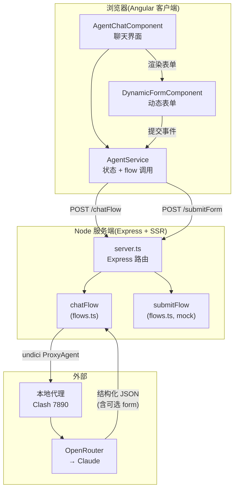
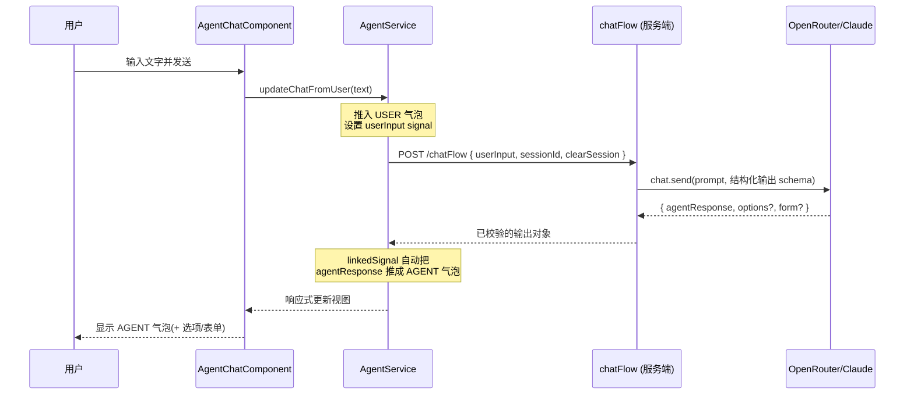
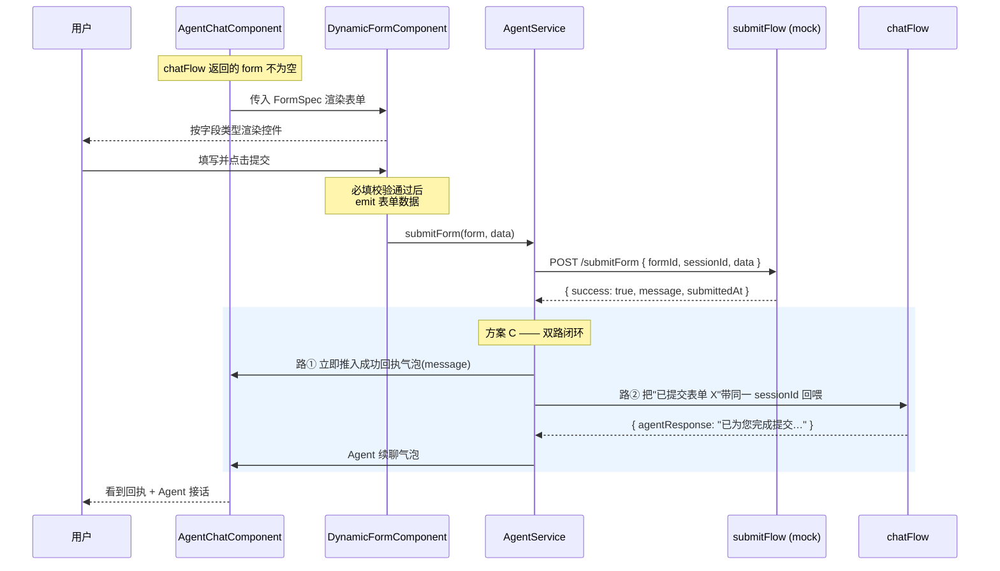

# a2ui-angular 系统架构说明书

> 一个 **Angular 19 SSR + Genkit + OpenRouter/Claude** 的全栈应用。
> 核心能力:与 AI Agent 对话,Agent 不仅能回复文字,还能**动态生成表单**让用户填写并提交(Agent-to-UI,即 "a2ui")。

最后更新:2026-06-06

---

## 1. 技术栈总览

| 层 | 技术 | 说明 |
| --- | --- | --- |
| 前端 | Angular 19(Standalone Components、Signals、`resource`/`linkedSignal`) | 聊天界面 + 动态表单渲染 |
| 渲染 | Angular SSR(`@angular/ssr`)+ Express | 服务端渲染首屏 + 客户端 hydration |
| AI 编排 | Genkit(`genkit/beta`)+ `@genkit-ai/express` | 定义并暴露 flow 为 HTTP 端点 |
| 模型接入 | `@genkit-ai/compat-oai`(OpenAI 兼容)→ OpenRouter | 默认模型 `anthropic/claude-opus-4.8` |
| 出网代理 | `undici` `ProxyAgent` | 让 OpenRouter 请求走本地代理(如 Clash 7890),绕过区域限制 |
| 校验 | `zod` | flow 的输入/输出 schema,并驱动 Genkit 结构化输出 |

---

## 2. 目录结构(关键文件)

```
src/
├── server.ts                       Express + SSR 入口;注册 /chatFlow、/submitForm 端点
├── flows.ts                        Genkit flow 定义:chatFlow(对话)+ submitFlow(表单提交 mock)
├── main.server.ts / main.ts        SSR / 浏览器 启动引导
└── app/
    ├── app.component.*              根组件,仅挂载 <app-agent-chat />
    ├── app.config.ts               客户端 providers(hydration、动画)
    ├── agent.service.ts            前端状态核心:会话、对话历史、调用 flow、表单提交闭环
    ├── agent-chat/                 聊天界面组件(输入框、气泡、快捷选项、嵌入动态表单)
    └── dynamic-form/               动态表单组件:按字段类型渲染控件 + 必填校验
docs/
├── ARCHITECTURE.md                 本文件
└── superpowers/specs/              设计 spec 文档
```

---

## 3. 系统架构图



**要点:**
- 前端只认两个端点:`/chatFlow`(对话)与 `/submitForm`(表单提交)。
- 只有 OpenRouter 的请求经 `ProxyAgent` 走本地代理;对 localhost 的内部请求(如 Genkit Developer UI 追踪)不走代理,避免破坏 trace。
- `submitFlow` 当前是 **mock**(永远返回成功),是未来对接真实业务系统的占位边界。

---

## 4. 数据契约

### chatFlow

```
输入: { userInput: string, sessionId: string, clearSession: boolean }
输出: {
  agentResponse: string         // Agent 的文字回复
  options?: string[]            // 可选:快捷回复选项
  form?: FormSpec               // 可选:需要用户填表时附带
}
```

### FormSpec(Agent 动态生成的表单结构)

```
FormSpec = {
  formId: string                // 表单实例 id,提交时回指
  title: string
  fields: FormField[]
  submitLabel?: string          // 提交按钮文案,默认"提交"
}

FormField = {
  name: string                  // 提交时的字段 key
  label: string                 // 显示名
  type: 'text' | 'textarea' | 'number' | 'select' | 'checkbox'
  required: boolean
  options?: string[]            // 仅 type === 'select' 时使用
  placeholder?: string
}
```

> Genkit 用上面的 zod schema **强约束**模型输出:`type` 只能取枚举内的值、`required` 必为 boolean。模型若产出不合法结构,会在 schema 层被拦截并触发重试,从源头杜绝"脏 schema"流到前端。

### submitFlow

```
输入: { formId: string, sessionId: string, data: Record<string, unknown> }
输出: { success: boolean, message: string, submittedAt: string }
```

当前实现:无论收到什么,一律返回 `success: true`。

---

## 5. 对话基础流程(时序图)



---

## 6. 动态表单交互闭环(时序图,本项目核心)

当 Agent 判断"需要收集结构化信息"(注册、登录、预约等),返回的输出里会带 `form`。此后流程:



**双路闭环的设计意图:** 路①给用户**即时反馈**(不必等模型),路②让**对话自然延续**(Agent 知道用户提交了什么、可以接着引导)。两者在 `AgentService.submitForm()` 中实现。

---

## 7. 前端状态管理(AgentService)

基于 Angular Signals 的响应式数据流,无需手写订阅:

| 成员 | 类型 | 作用 |
| --- | --- | --- |
| `userInput` | `signal` | 当前要发送的用户输入;**写它即触发** `agentResource` 重新请求 |
| `agentResource` | `resource` | 以 `userInput` 为 request,自动调用 `/chatFlow` 并缓存结果/加载态 |
| `sessionId` | `linkedSignal` | 首次生成、之后保持,贯穿整个会话 |
| `clearSession` | `linkedSignal` | 首次为 `true`(清空),之后为 `false`(保留上下文) |
| `chat` | `linkedSignal` | 对话历史(气泡数组);随 `agentResponse` 自动追加 AGENT 气泡 |

> 关键机制:把新文本写入 `userInput`,`resource` 就会自动发起一次 `chatFlow` 调用——表单提交的"路②回喂"正是复用了这一点。

---

## 8. 运行方式

```bash
# 安装依赖
npm install

# 准备环境变量:复制 .env.example 为 .env,填入 OPENROUTER_API_KEY
# 若处于区域受限网络,设置 HTTPS_PROXY=http://127.0.0.1:7890

# 开发服务器(纯前端,默认 4200,不含 SSR/flow 端点)
npm start

# 构建 + 带 Genkit Developer UI 启动 SSR 生产服务(默认 8540)
npm run start:with-genkit-ui

# 仅类型检查
npm run typecheck
```

> 注意:`/chatFlow`、`/submitForm` 这两个端点由 SSR 服务端(`server.ts`)提供,因此体验完整表单能力需用 `start:with-genkit-ui`(或先 `npm run build` 再 `npm run serve:ssr:app`),而非 `npm start`。

---

## 9. 已知边界与后续方向

- **submitFlow 是 mock**:不落库、不校验业务规则,永远成功。接真实业务只需替换 `flows.ts` 中 `submitFlow` 的函数体,端点契约与前端不变。
- **字段类型为精简核心集**:`text / textarea / number / select / checkbox`。后续可扩展 `email / password / date / radio / 文件上传`,需同步前端渲染与校验。
- **会话存储在服务端内存**:进程重启即丢失,且为演示性质;生产需替换为持久化会话管理。
- **单组件挂载**:`app-root` 仅渲染 `app-agent-chat`,目前无路由分页。
